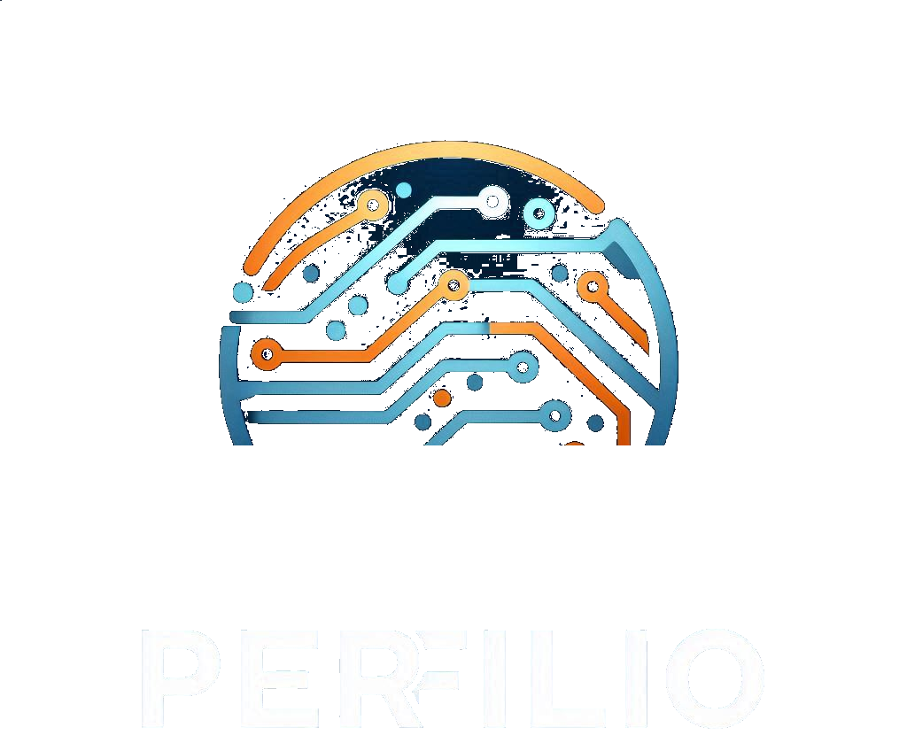
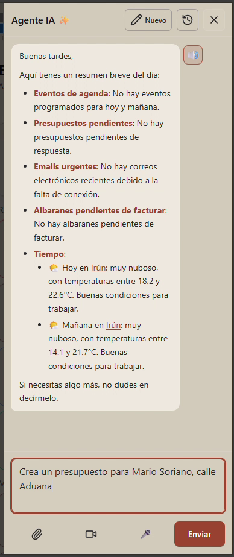
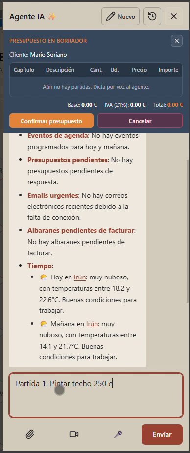
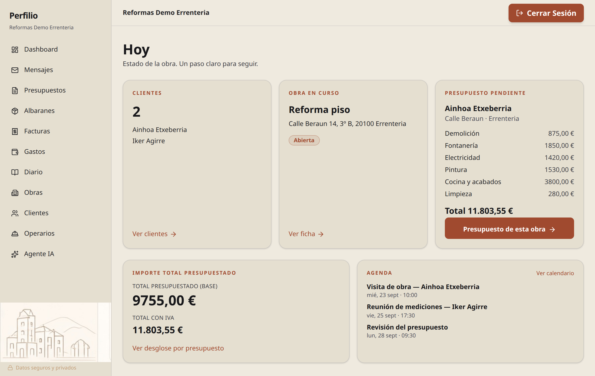
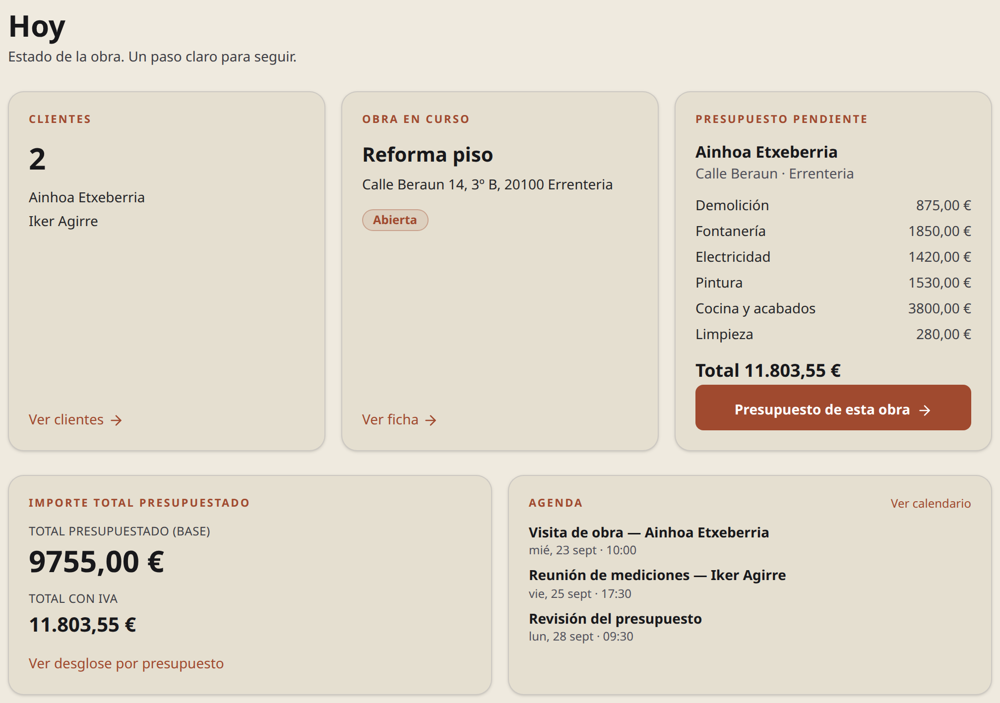
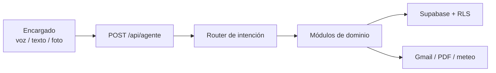

<p align="center">
  
</p>

<h1 align="center">Perfilio</h1>
<p align="center"><strong>El encargado que no duerme.</strong></p>

<p align="center">
  Agente de operaciones con IA para <strong>gremios de construcción y reformas en el País Vasco</strong>.<br />
  Dictas en obra. Él presupuesta, factura, anota gastos y lleva el equipo.
</p>

<p align="center"><em>EN — Operations agent for Basque construction trades. Dictate a quote. Log an expense from a photo. Keep the jobsite moving.</em></p>

<p align="center">
  
  
  
  
  
</p>

<p align="center">
  <a href="https://perfilio.vercel.app"><strong>Demo en vivo</strong></a>
  ·
  <a href="https://wa.me/34697613884?text=Hola%2C%20he%20visto%20Perfilio%20y%20quiero%20acceso%20a%20la%20beta"><strong>Acceso beta (WhatsApp)</strong></a>
  ·
  <a href="https://github.com/adopico83/perfilio"><strong>GitHub</strong></a>
</p>

<p align="center">
  SaaS en producción · TFG (DAW) · Beta cerrada
</p>

<p align="center">
  
  
</p>

<p align="center"><sub>Agente IA: briefing del día → “Crea un presupuesto…” → borrador con IVA. Fotogramas reales de <code>public/demo_nueva.mp4</code>.</sub></p>

---

## El problema

El encargado está en faena. El papeleo no espera: presupuestos, albaranes, facturas, tickets, horas, correo.

Perfilio **no es un ERP con un chat encima**. Es un agente que **ejecuta**: voz, foto y texto se convierten en documentos y registros reales.

| | |
|---|---|
| **Para quién** | Albañilería, reformas, pintura, fontanería, electricidad e interiorismo en Euskadi |
| **Qué no es** | Software pasivo. No te deja solo ante otra pantalla más |

---

## Qué puedes hacer hoy

- **Dictar un presupuesto** — partidas en lenguaje de gremio (m², ml, jornadas); tarifas base País Vasco 2025 + tarifas del negocio; PDF con IVA.
- **Gasto desde foto** — adjuntas el ticket; el modelo ve la imagen y categoriza el gasto.
- **Diario de obra** — foto + audio → entrada estructurada → PDF.
- **Ciclo comercial** — obra → cliente → presupuesto → albarán → factura (también extras y conversiones).
- **Equipo** — operarios y horas por obra.
- **Correo con freno humano** — Gmail OAuth2; el agente redacta, tú apruebas el envío.
- **Briefing del día** — agenda, pendientes, albaranes sin facturar, tiempo en obra (OpenWeather).
- **Avisos de fondo (“El Bicho”)** — insights de inactividad, rentabilidad y facturación sobre obras activas.
- **Grok Bot por MCP** — un agente externo puede operar el negocio desde fuera del chat de la app. Habla con Perfilio en `/api/mcp`. Tools actuales: `crear_presupuesto`, `crear_cita`, `ver_citas`, `crear_entrada_diario`, `registrar_horas`, `ver_obras_activas`, `ver_facturas_pendientes`, y fotos de diario (`crear_upload_firmado_diario` + `adjuntar_foto_diario`).
- **Presupuesto dictado desde Grok Bot** — voz o texto. El bot guarda el documento con `crear_presupuesto` (el texto queda en `presupuesto_generado`). El PDF lo pinta la plantilla oficial de Perfilio (`/api/pdf/presupuesto/[id]`, `PresupuestoPdfDocument`).
- **Citas** — `crear_cita` guarda la cita en la agenda de Perfilio y `ver_citas` la lista. Si el cliente quiere el mismo evento en Google Calendar, con el recordatorio nativo de 15 minutos, eso lo hace el Grok Bot del cliente a partir de `google_calendar_hint`. Perfilio no llama a Google ni guarda OAuth de Calendar.

PWA instalable (dashboard + push de agenda). Paleta crema `#EFEADF` / terracota `#A04A2F`.

---

## La demo: nav izquierda y home Hoy

El tenant **Reformas Demo Errenteria** ya entra con otra cáscara: barra lateral (Dashboard, Mensajes, Presupuestos, Albaranes, Facturas, Gastos, Diario, Obras, Clientes, Operarios y Agente IA) y una home **Hoy** con clientes, obra en curso, presupuesto pendiente, importe y agenda.

Es la experiencia enriquecida de la **demo** y la **dirección candidata** del dashboard principal. El panel de un cliente en producción puede seguir con el nav de arriba: este shell no está en todos los tenants.

<p align="center">
  
</p>
<p align="center"><sub>Home Hoy del tenant demo, con la navegación a la izquierda. Dirección candidata del dashboard; el cliente en producción puede verse distinto.</sub></p>

<p align="center">
  
</p>
<p align="center"><sub>Cards de Hoy: clientes, obra en curso, presupuesto pendiente, importe total y agenda. Datos de la demo, no de un cliente real.</sub></p>

---

## Pruébalo en 60 segundos

### Opción A — ver el producto

1. Abre **[perfilio.vercel.app](https://perfilio.vercel.app)** (landing pública).
2. Pide acceso: **[WhatsApp](https://wa.me/34697613884?text=Hola%2C%20he%20visto%20Perfilio%20y%20quiero%20acceso%20a%20la%20beta)**. La beta es cerrada; no hay registro self-service.
3. Con cuenta, entra en `/login` → `/dashboard`. La cuenta demo abre el shell de la sección anterior (nav izquierda + Hoy). El resto de cuentas puede seguir con el nav de arriba.

### Opción B — local (devs)

Hace falta un proyecto Supabase (Auth + tablas), una `OPENAI_API_KEY` y, para el clasificador de intención, `JEV_API_KEY` (ver `.env.example`).

```bash
git clone https://github.com/adopico83/perfilio.git
cd perfilio
npm install
# crea .env.local (tabla de abajo)
npm run dev
```

Abre [http://localhost:3000](http://localhost:3000). Crea el usuario en el panel de Supabase Auth (ver `AUTH_SETUP.md`).

```bash
npm test          # 234 tests en 43 ficheros
npm run build && npm start
```

---

## Stack (verificado en `package.json`)

| Capa | Tecnología |
|------|------------|
| App | **Next.js 16.1** (App Router) · **React 19** · **TypeScript 5** · **Tailwind CSS v4** · Framer Motion |
| Backend | Route Handlers `app/api/*` · Server / Client Components |
| Datos | Supabase (PostgreSQL + Auth + Storage + **RLS**) |
| IA | OpenAI (chat + tools + Whisper STT + TTS `onyx`) |
| Docs | `@react-pdf/renderer`, jsPDF |
| Email | Resend (transaccional) · Gmail API (operativo) |
| Deploy | **Vercel** (`perfilio.vercel.app`) · cron de push: GitHub Actions → `/api/cron/agenda-push` |
| Tests | Jest 30 + Testing Library |

---

## Arquitectura (versión corta)



1. El route **clasifica** la intención con TypeSafe Jev (`parseAgentIntentCategory` en `lib/agente/router.ts`): categorías cerradas `presupuesto | factura | diario | horas | gastos | obras | clientes | correo | agenda | general`, mapeadas a los módulos internos. Si Jev no responde o la confianza es menor de 0.7, cae a `general`.
2. Ejecuta **solo las tools de esa categoría**.
3. La lógica vive en `lib/agente/modules/*`. El route orquesta.

### Regla de oro

`app/api/agente/route.ts` (~1.200 líneas) es **orquestador**: system prompt, tool calling, routing. **No añadir dominio nuevo ahí.** Código nuevo → `lib/agente/modules/` y se importa.

Módulos actuales: `presupuestos`, `documentos`, `obras-clientes`, `gastos`, `diario`, `operarios`, `agenda`, `correo`, `canvas`, `calculo`. Apoyo: `router.ts`, `guardrails.ts`, `orquestacion.ts`.

`POST /api/mcp` autentica con Bearer (`MCP_API_TOKEN`). Las tools leen y escriben solo el negocio de `MCP_BUSINESS_ID`.

### Dónde está cada cosa

```
app/page.tsx              Landing
app/login/                Auth
app/dashboard/            Panel
app/{obras,clientes,presupuestos,albaranes,facturas,gastos,diario,operarios}/
app/api/agente/           Orquestador + conversaciones
app/api/mcp/              MCP para Grok Bot y otros agentes
lib/agente/modules/       Dominio extraído
lib/mcp/                  Tools MCP (presupuesto, citas, diario, horas)
components/dashboard/     Sidebar agente, canvas, modales
supabase/migrations/      Esquema + políticas RLS
```

### RLS (multi-tenant)

Cada tabla operativa cuelga de `business_profiles`. Patrón:

```sql
EXISTS (
  SELECT 1 FROM business_profiles bp
  WHERE bp.id = tabla.business_id
    AND bp.user_id = auth.uid()
)
```

Tablas clave: `obras`, `clientes`, `presupuestos`, `albaranes`, `facturas`, `gastos`, diario, `operarios`, `tarifas`, conversaciones, tokens Gmail, push.

---

## Variables de entorno

Crear `.env.local`. **Nunca commitear secretos.**

| Variable | Uso |
|----------|-----|
| `NEXT_PUBLIC_SUPABASE_URL` | Proyecto Supabase |
| `NEXT_PUBLIC_SUPABASE_ANON_KEY` | Cliente + RLS |
| `SUPABASE_SERVICE_ROLE_KEY` | Server privilegiado |
| `OPENAI_API_KEY` | Chat, tools, Whisper, TTS |
| `JEV_API_KEY` | Clasificador de intención del agente (TypeSafe Jev, `POST /v1/systemone`). Sin key, o si falla, la categoría es `general` |
| `NEXT_PUBLIC_APP_URL` | Callbacks (p. ej. Gmail) |
| `GOOGLE_CLIENT_ID` / `GOOGLE_CLIENT_SECRET` | OAuth2 Gmail |
| `RESEND_API_KEY` | Emails transaccionales |
| `OPENWEATHER_API_KEY` | Tiempo en obra |
| `NEXT_PUBLIC_VAPID_PUBLIC_KEY` / `VAPID_PRIVATE_KEY` | Push PWA |
| `CRON_SECRET` | Protege `/api/cron/*` |
| `MCP_API_TOKEN` | Bearer de `/api/mcp` |
| `MCP_BUSINESS_ID` | Negocio que operan las tools de esa conexión |

Opcionales: `RESEND_FROM`, `NOTIFICATION_EMAIL`, `VAPID_MAILTO`, `ALERT_EMAIL`.

---

## Roadmap

- [ ] **MCP y playbook de Grok Bot** — madurar las tools y el guion del bot externo: dictado de presupuesto hacia la plantilla PDF oficial, citas en la agenda de Perfilio y copia opcional a Google Calendar (recordatorio de 15 minutos en el bot del cliente, sin OAuth de Calendar en el servidor)
- [ ] **TicketBAI** — facturación Euskadi ([ticketbaiws.eus](https://ticketbaiws.eus)); las facturas se generan, la conexión Hacienda no está cerrada
- [ ] **Outlook / Microsoft Graph** — email paralelo a Gmail
- [ ] **Profit Protector** — gasto real vs presupuestado por obra
- [ ] **Follow-up** de presupuestos enviados sin respuesta
- [ ] Más dominio fuera del orquestador
- [ ] Ampliar la beta cerrada

---

## Contribuir y contacto

Issues y PRs bienvenidos si el cambio es concreto (bug, test, docs). Antes de tocar el agente: lee la **regla de oro** y `docs/chuleta-agente.md`.

| | |
|---|---|
| Demo / beta | [WhatsApp](https://wa.me/34697613884?text=Hola%2C%20he%20visto%20Perfilio%20y%20quiero%20acceso%20a%20la%20beta) |
| Producto | [perfilio.vercel.app](https://perfilio.vercel.app) |
| Código | [github.com/adopico83/perfilio](https://github.com/adopico83/perfilio) |
| Email producto | hello@perfilio.app |

Uso restringido (producto + TFG). No hay licencia open-source. El repo es público para mostrar el trabajo, no para redistribuir el SaaS.

**Perfilio** — *el encargado que no duerme.*
