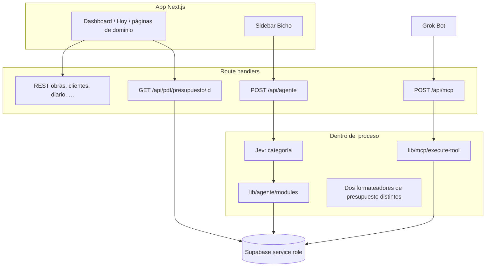

# Perfilio — Hoja de ruta del harness de agente

Documento de arquitectura y plan por fases. No implementa nada: describe el código que hay hoy (septiembre 2026) y el orden de PRs más corto para que un modelo no pueda corromper datos, con Grok Bot como interfaz por ahora y el cerebro del producto dentro de Perfilio más adelante.

Lectores: Ander y quien abra el siguiente PR. El argot se explica la primera vez que aparece.

---

## 1. Vocabulario (para no mezclar piezas)

Un agente de verdad son seis piezas. Hoy Perfilio tiene varias a medias y ninguna cerrada como contrato.

| Pieza | Qué es, en cristiano | Dónde vive hoy |
| --- | --- | --- |
| **Modelo** | El que lee el mensaje y decide qué hacer | OpenAI `gpt-4o-mini` en `POST /api/agente`. Grok, fuera, cuando llama al MCP |
| **Tools** | Funciones con nombre, argumentos y resultado. El modelo no escribe en la base: pide una tool y el servidor ejecuta | Módulos en `lib/agente/modules/*` y, aparte, `lib/mcp/execute-tool.ts` |
| **Ventana de contexto** | Lo que el modelo ve en *este* turno (prompt, historial reciente, fichas) | System prompt de `/api/agente` + últimos 10 mensajes que manda el cliente. Grok tiene la suya, Perfilio no la ve |
| **Memoria** | Hechos que sobreviven al chat | Tabla `memoria_negocio`. No es el historial del chat |
| **Harness** | El programa que posee el contrato: qué tools existen, en qué orden, qué se considera éxito y cuándo se para | No hay uno. Hay un route grande y un servidor MCP fino |
| **Bucle** | Ejecutar → mirar el resultado → validar → corregir, con un tope | Un solo disparo por turno. Si la tool falla, se corta la prosa. No hay segundo intento con el error en la mano |

**Grok Bot** es el cliente de fuera (el que Ander usa y en el que confía para limpiar la orden y reintentar). **Bicho** es el agente de dentro de la app (`POST /api/agente`). **Jev** (`lib/agente/router.ts`) solo clasifica la intención en una categoría cerrada. No planifica ni ejecuta.

---

## 2. Arquitectura actual

Stack real: Next.js 16 (App Router), React 19, Supabase (Postgres + Auth + Storage + RLS), OpenAI en el agente de la app, MCP oficial (`@modelcontextprotocol/sdk`) en `/api/mcp`.

### 2.1 Rutas de producto

Páginas autenticadas: `app/dashboard`, `app/obras`, `app/clientes` y `app/clientes/[id]`, `app/presupuestos`, `app/albaranes`, `app/facturas`, `app/gastos`, `app/diario`, `app/operarios`, `app/agente`, `app/mensajes`, `app/historial`. Landing en `app/page.tsx`, login en `app/login`.

Hay un segundo flujo viejo de “mensajes”: `app/mensajes` + `app/agente` + `POST /api/assistant`, tablas `conversations` / `ai_responses`. No comparte tools con Bicho. Son dos cerebros.

### 2.2 APIs internas (candidatas a tool, no lo son todavía)

| Ruta | Qué hace |
| --- | --- |
| `POST /api/agente` | Orquestador de Bicho. ~1.170 líneas. System prompt, Jev, tool calling, prosa |
| `GET /api/agente/conversaciones` | Lista hilos leyendo `conversation_history` |
| `POST /api/mcp` | Servidor MCP. Stateless. Bearer + un solo negocio |
| `GET/POST /api/obras`, `GET/PATCH/DELETE /api/obras/[id]` | CRUD de obras con sesión |
| `GET/POST /api/clientes`, `GET/PATCH/DELETE /api/clientes/[id]` | CRUD de clientes con sesión |
| `GET/POST /api/diario`, `PATCH/DELETE /api/diario/[id]`, `POST /api/diario/upload` | Diario y fotos |
| `POST /api/presupuestos/reabrir-borrador`, `POST /api/presupuestos/generar-factura` | Transiciones de documento |
| `GET /api/pdf/presupuesto/[id]`, `GET /api/pdf/factura/[id]` | PDF oficial. Exigen cookie de usuario dueño del negocio |
| `GET /api/albaranes/sin-facturar`, `GET /api/gastos/resumen`, `GET /api/operarios/resumen` | Lecturas de panel |
| `POST /api/transcribe`, `POST /api/tts` | Voz de la app (Whisper / TTS). Grok no pasa por aquí |
| Gmail: `/api/auth/gmail/*`, `/api/gmail/recent`, `/api/gmail/urgentes`, `/api/gmail/send` | Correo del negocio |
| `POST /api/assistant` | Asistente legacy de mensajes |

La regla de oro del README sigue vigente: dominio nuevo no se añade dentro de `app/api/agente/route.ts`. Va a `lib/`.

### 2.3 Agente de la app (Bicho)

Un turno de `POST /api/agente` hace esto, y se para:

1. El cliente manda `mensaje`, `business_id`, `historial` (como mucho se usan los 10 últimos) e imágenes opcionales.
2. Se carga el perfil (`business_profiles`), hasta 10 obras abiertas, 10 clientes, filas de `memoria_negocio` y, en el primer mensaje, la agenda de hoy y mañana.
3. **Jev** (`parseAgentIntentCategory`) elige una categoría. Timeout 2 s, confianza mínima 0,7. Si no hay key, falla la red o la confianza es baja, la categoría es `general`.
4. `general` **no filtra tools**: el modelo ve el catálogo entero. El resto de categorías ve un subconjunto (`toolsForAgentIntent`).
5. Una llamada a `gpt-4o-mini` con temperatura 0. Si no hay tool calls y el texto parece una acción, **un** reintento con `tool_choice: required` (`lib/agente/orquestacion.ts`).
6. `applyPerfilioGuardrails` deduplica, bloquea algunos borrados/facturas sin estado, y **se queda solo con la última tool de lectura**.
7. Se ejecutan las tools **en serie, una vez**. No hay otra vuelta al modelo para corregir argumentos.
8. Si toda mutación falla, la prosa no pasa por el modelo: se devuelve el error (`prosaFailClosedSiAplica`). Si hay éxito, una segunda llamada redacta y `anclarProsaAHechos` intenta quitar un “ya está añadido” mentira.
9. Log a `console.info` con forma `agente_turno`. No hay tabla de ejecuciones.

El modelo del chat es `gpt-4o-mini`. El dictado de partidas (`estructurarDictadoEnPartidas`) es otra llamada al mismo modelo, temperatura 0,25. Jev es otro proveedor (`api.typesafe.ai`).

### 2.4 MCP (lo que ve Grok)

Entrada: `app/api/mcp/route.ts`. El middleware **no** pide sesión de Supabase en `/api/mcp`. Auth en `lib/mcp/auth.ts`:

- Header `Authorization: Bearer <MCP_API_TOKEN>` (comparación en tiempo constante).
- El negocio es **uno**, el de `MCP_BUSINESS_ID`.
- Cliente Supabase con **service role** (se salta RLS). Cada query debe filtrar `business_id` a mano.
- `userId` es `MCP_USER_ID` o el literal `mcp-integration`. No hay usuario real.
- Sin sesión MCP (`sessionIdGenerator: undefined`). Cada POST es un turno aislado.

Registro de tools: `lib/mcp/server.ts`. Ejecución: `lib/mcp/execute-tool.ts`. Citas: `lib/mcp/citas.ts`.

### 2.5 Presupuesto y PDF (el corte que importa)

Hay **dos textos distintos** guardados en `presupuestos.presupuesto_generado`:

| Camino | Función | Forma de una partida |
| --- | --- | --- |
| Borrador conversacional, al confirmar | `generarTextoPresupuestoDesdeItems` en `lib/agente/modules/presupuestos.ts` | `1. Alicatado \| Cantidad: 15 \| Precio: 50,00 € \| Importe: 750,00 €` más pie `BASE IMPONIBLE: … \| IVA (21%): … \| TOTAL: …` |
| Dictado de una tacada | `formatearBorradorPresupuestoDictado` en `lib/dictado-presupuesto.ts` | `1. Alicatado - 15 m2 x 50.00€ = 750.00€` y pie `SUBTOTAL:` / `TOTAL:` |
| MCP `crear_presupuesto` | ninguna | Lo que Grok ponga en `descripcion`, y el `total` numérico que Grok envíe |

El PDF (`lib/pdf/parser.ts` → `lib/pdf/presupuesto.tsx` → `GET /api/pdf/presupuesto/[id]`) **solo entiende la primera forma**. El dictado y el MCP no la generan. Un presupuesto “guardado” puede abrir un PDF sin partidas y sin pie.

Además:

- `confirmar_borrador` numera con `insertarPresupuestoConNumeroCorrelativo` (`lib/presupuestos/numero.ts`) y escribe el texto canónico.
- `generar_presupuesto_por_dictado` hace `insert` directo, sin número correlativo, y no devuelve `presupuesto_id`.
- MCP `crear_presupuesto` sí numera, estado `borrador`, pero **confía en el `total` del modelo**. No recalcula partidas. No hay vista previa.
- El PDF exige usuario logueado dueño del negocio (`assertUserOwnsBusiness`). Grok no tiene esa cookie. Aunque el id sea bueno, el bot no puede descargar el PDF por esa ruta.

`estructurarDictadoEnPartidas` sí valida cantidad y precio finitos antes de formatear. El modelo de dictado puede estimar cantidad si el encargado no la dijo (regla 4 del prompt). Eso es una alucinación de medición: hay que marcarla, no tratarla como dato cerrado.

### 2.6 Auth y tenancy

- Middleware (`middleware.ts`): sesión obligatoria en `/dashboard` y en `/api/*`, con huecos explícitos para `/api/mcp`, `/api/cron/*` y `/api/lista-espera-notificacion`.
- Dueño: `business_profiles.user_id`. Miembro: `business_users`. `assertUserOwnsBusiness` mira las dos.
- RLS en tablas de dominio: la fila cuelga de un `business_id` cuyo perfil pertenece a `auth.uid()`.
- **Bicho y MCP no usan la anon key para escribir.** Usan service role. La RLS no les protege. La protección es el filtro en código.
- En `POST /api/agente`, `assertUserOwnsBusiness` solo corre en el atajo `tool=editar_factura`. El camino normal acepta `business_id` del cuerpo si hay *alguna* sesión. Un usuario logueado podría apuntar a otro negocio. Hay que cerrarlo antes de dar más poder de escritura a tools.

### 2.7 Tablas que importan al estado del agente

| Tabla | Papel | Notas de código |
| --- | --- | --- |
| `business_profiles` | Identidad del negocio, tarifas texto, ciudad, emisor PDF | Una fila por negocio |
| `memoria_negocio` | Hechos estables (categoría + clave + texto). Única por `(business_id, clave)` | La usa Bicho. MCP no la lee ni la escribe |
| `presupuesto_borrador` + `presupuesto_borrador_items` | Borrador en construcción. Un activo por `(business_id, user_id)` | `user_id` real. Con `mcp-integration` todos los hilos de Grok compartirían un solo borrador |
| `presupuestos` | Documento. `presupuesto_generado` es el texto que pinta el PDF | Estados usados en tools: pendiente, aceptado, rechazado, facturado, pagado, y `borrador` en altas nuevas |
| `conversation_history` | Chat de Bicho, lo escribe el sidebar en cliente | El SQL del repo (`20250315000000`) no tiene `conversation_id`; la app selecciona esa columna. El esquema vivo y las migraciones no coinciden |
| `conversations` / `ai_responses` | Flujo legacy de aprobación de mensajes | Otro producto dentro del mismo repo |
| `agenda` | Citas. MCP interpreta fechas en `Europe/Madrid` y devuelve `google_calendar_hint` | Perfilio no llama a Google Calendar |
| `diario_obra` + bucket `diario-obra` | Entradas y fotos (URL firmada, sin base64) | Tope de tamaño y de ítems en `lib/diario-obra-ingest.ts` |
| `tarifas` | Precios del negocio para el dictado | Si no hay filas, se usa `lib/tarifas-base.ts` |
| `operarios`, `registros_jornada` | Horas | MCP actualiza la jornada del día si ya existe (idempotente) |
| `obras`, `clientes`, `facturas`, `albaranes`, `gastos` | Dominio | MCP solo lee obras activas y facturas pendientes |

No hay tabla de runs, de previsualizaciones ni de “sesión de agente”.

---

## 3. Inventario de tools

### 3.1 MCP expuesto a Grok (9)

Definidas en `lib/mcp/server.ts`, ejecutadas en `lib/mcp/execute-tool.ts`.

| Tool | Mutación | Contrato de error hoy |
| --- | --- | --- |
| `crear_cita` | Sí, agenda | Validación de fecha/hora en Madrid, ventana 8:00–20:00, duplicados. Objeto rico (`ok`, `google_calendar_hint`) |
| `ver_citas` | No | Lista próximas, tope 10 (máx. 20) |
| `ver_obras_activas` | No | Hasta 10, estado distinto de `cerrada`. Sin búsqueda por nombre |
| `ver_facturas_pendientes` | No | Hasta 10 en estado `pendiente` |
| `crear_presupuesto` | Sí | Exige nombre, texto y total numérico. **El total no se recalcula.** Obra opcional por UUID |
| `registrar_horas` | Sí | Si hay 0 o varias coincidencias de operario u obra, error en texto y no escribe. Si la jornada del día existe, actualiza |
| `crear_entrada_diario` | Sí | Obra por nombre. 0 o varias coincidencias → no escribe |
| `crear_upload_firmado_diario` | Subida | URL firmada al bucket del negocio |
| `adjuntar_foto_diario` | Sí | `storage_paths` (camino del bot) o `foto_urls`. Rechaza base64 |

Huecos para que Grok opere el negocio sin inventar:

| Necesidad | Estado |
| --- | --- |
| Dictado → partidas validadas → texto que el PDF entiende | No está en MCP. En la app, el dictado usa otro formato |
| Vista previa que no escribe, y confirmación que no acepta un total nuevo del modelo | Solo en Bicho (`solo_vista_previa` de `generar_presupuesto_por_dictado`). MCP escribe a la primera |
| Enlace de PDF usable por el bot | No. El GET del PDF pide cookie |
| Leer un presupuesto, buscar cliente, ficha de obra, listar diario | No en MCP. Sí en Bicho |
| Crear / actualizar obra, editar o borrar cita, editar diario | No en MCP. Sí, en parte, en Bicho |
| Errores con código estable (`ok: false`, `code`, `candidatos`) | Citas y horas se acercan. Presupuesto MCP devuelve `{ error: string }` o `{ ok: true }` según el caso. Bicho mezcla `{ error }`, `{ ok: false }` y `{ mensaje }` |
| Memoria de negocio | No en MCP |
| Gastos, facturas de verdad (crear/cobrar), albaranes, correo, tarifas | Solo en Bicho. No hace falta abrirlos en MCP en las primeras fases |

### 3.2 Tools de Bicho (no salen por MCP)

Agrupadas por módulo. El route las ejecuta; no hay un registro único importado por el MCP.

**Presupuestos** (`lib/agente/modules/presupuestos.ts`): `listar_presupuestos`, `obtener_presupuestos_pendientes`, `buscar_presupuesto`, `cambiar_estado_presupuesto`, `editar_presupuesto`, `vincular_presupuesto_cliente`, `convertir_presupuesto_a_albaran`, `convertir_presupuesto_a_factura`, `iniciar_borrador_presupuesto`, `agregar_partida_borrador`, `modificar_partida_borrador`, `listar_partidas_borrador`, `eliminar_partida_borrador`, `confirmar_borrador`, `cancelar_borrador`, `obtener_borrador_activo`.

**Documentos** (`documentos.ts`): facturas y albaranes (listar, pendientes, estado, editar), `albaranes_sin_facturar`, `generar_presupuesto_por_dictado`, `gestionar_tarifas`, `crear_presupuesto`, `crear_factura`, `crear_albaran`, `registrar_extra`, `listar_extras`, `convertir_albaran_a_factura`.

**Obras y clientes** (`obras-clientes.ts`): `crear_obra`, `actualizar_obra`, `buscar_obra`, `ver_ficha_obra`, `asociar_documentos_a_obra`, `crear_cliente`, `buscar_cliente`, `ver_cliente`.

**Diario:** `crear_entrada_diario`, `generar_pdf_diario`, `eliminar_entrada_diario`.

**Operarios:** `registrar_jornada`, `listar_operarios`, `consultar_horas_obra`, `consultar_horas_operario`, `eliminar_registro_jornada`.

**Agenda:** `obtener_agenda`, `crear_recordatorio`, `editar_recordatorio`, `eliminar_recordatorio`, `eliminar_evento_agenda`, `modificar_evento_agenda`.

**Gastos:** `registrar_gasto_ticket`, `vincular_gasto`, `eliminar_gasto`, `modificar_gasto`.

**Correo:** `leer_emails_recientes`, `enviar_email` (deja borrador; la UI confirma).

**Otras:** `calcular_medicion`, `mostrar_vista_visual`, `guardar_memoria`, `eliminar_memoria`, y en el route `get_directions` y `consultar_tiempo`.

`lib/agente/modules/grounding.ts` resuelve cliente, obra y presupuesto por nombre: 0 coincidencias o varias → `ok: false` y no crea la ficha “de paso”. Eso es lo que el MCP debería copiar, no un prompt más largo.

### 3.3 Qué no hay que hacer con este inventario

No publicar las ~60 tools de Bicho en el MCP “para que Grok pueda lo mismo”. Cada tool de Bicho asume `user_id` de sesión, prompts distintos y resultados heterogéneos. Copiarlas tal cual multiplicaría alucinaciones. El MCP debe llamar **funciones de dominio** ya validadas, con un resultado único.

---

## 4. Harness, memoria y bucle: qué hay y qué falta

### Ya existe (aprovechar, no reescribir)

- Clasificador de intención con categorías cerradas y umbral (Jev). Fail-closed a `general`.
- Subconjunto de tools por categoría (ahorra tokens y ruido), salvo en `general`.
- Un reintento si el modelo responde solo con texto ante una orden.
- Guardrails de plan: dedupe, bloqueo de borrar presupuesto aceptado/facturado, bloqueo de facturar lo ya facturado.
- Prosa anclada a resultados reales de mutación (no narrar éxito si `ok` no es true).
- Grounding por nombre con desambiguación en presupuestos, obras y clientes.
- Vista previa del dictado (`solo_vista_previa`) en Bicho.
- Idempotencia parcial: número de presupuesto con reintento ante `23505`; horas MCP actualizan la fila del día; citas MCP pueden devolver duplicado; guardrails tratan algunos duplicados como éxito.
- Memoria de negocio con categorías cerradas (`lib/memoria-negocio.ts`).
- Borrador de presupuesto en base de datos, un activo por usuario.
- Logs de turno en stdout.

### No existe

- Un harness: un módulo que reciba “intención + contexto”, elija tools, ejecute, observe y decida parar. Hoy eso está cosido en el route.
- Bucle de corrección. Si `agregar_partida_borrador` devuelve “no existe el cliente”, el modelo no recibe ese error para buscar o preguntar **en el mismo turno**. Grok puede hacerlo en el turno siguiente porque él lleva la conversación. Bicho no.
- Validación aritmética común (cantidad × precio = importe, IVA, total) antes de persistir, compartida por dictado, borrador y MCP.
- Token de previsualización: un id opaco que la confirmación debe citar, para no guardar los números que el modelo reescriba.
- Bitácora de runs (tool, args resumidos, ok/error, intento).
- Contrato único de error para MCP y Bicho.
- Separación de sesión de Grok. El `user_id` fijo del MCP no sirve como clave de borrador.
- PDF alcanzable por el bot.
- Tests de “el modelo dijo un total y el servidor lo rechazó”. Hay tests de anti-alucinación de prosa y de grounding; no cubren el MCP de presupuesto.

---

## 5. Cómo partir la memoria

Tres sitios, y no se pisan.

### Memoria de negocio (base de datos, larga)

Tabla `memoria_negocio`. Hechos que un encargado querría que “el siguiente presupuesto ya lo sepa”: proveedor habitual, precio que siempre usa, forma de presentar el PDF, corrección técnica.

- La escribe el producto, con categoría cerrada, nunca el modelo a pelo.
- La leen Bicho (ya) y, más adelante, una tool de lectura del MCP.
- No guarda chats, ids de turno, borradores ni “lo último que dijo Grok”.

### Estado de tarea (base de datos, corta)

El borrador (`presupuesto_borrador` + items) y, en la fase del corte vertical, una previsualización con caducidad (fila o token firmado: partidas ya validadas, hash, `business_id`, expira en minutos).

- Es el documento a medio hacer, no un recuerdo.
- Clave: negocio + **sesión**, no el usuario falso `mcp-integration`.
- Confirmar lee esa fila. No acepta un total nuevo en el argumento.
- Al confirmar o cancelar, deja de estar activa.

### Contexto de sesión (ventana, no es memoria)

- **Bicho:** los 10 últimos mensajes que el sidebar reenvía, más obras/clientes/memoria inyectados en el prompt. Se pierde al cerrar si el cliente no los manda. `conversation_history` es el archivo del chat en la UI; el route no lo usa como fuente de verdad del turno.
- **Grok:** su propia ventana y su memoria de producto Grok. Perfilio no debe copiar esa transcripción. Cada tool debe devolver ids, candidatos y el error literal para que Grok corrija en el turno siguiente sin adivinar.

### Qué no mezclar

| Si se guarda en… | Pasa esto |
| --- | --- |
| Memoria de Grok, un precio o un id de obra | Se pierde al cambiar de cliente, o se cuela en otro negocio |
| `conversation_history`, el hilo de Grok | Dos historiales, y el de la app no es el que Grok usa |
| `presupuesto_borrador` con `user_id = mcp-integration` | Un solo borrador para todos los hilos del bot |
| El prompt, un hecho que debe durar meses | Se cae al recortar los 10 mensajes |

La memoria de Grok sirve para cómo habla Ander con el bot (tono, recordatorios personales). Los datos del negocio viven en Supabase.

---

## 6. Fases

Orden por riesgo y por el corte **dictado → presupuesto validado → PDF**. Cada fase es uno o pocos PRs. No se abre la siguiente hasta cumplir el “hecho cuando”.

### Fase 0 — Este documento

**Objetivo.** Congelar vocabulario y el orden. Nada de código de agente.

**Entregable.** `docs/agent-harness-roadmap.md`.

**Hecho cuando.** El PR solo contiene este archivo.

### Fase 1 — El texto del presupuesto es uno solo

**Objetivo.** Cualquier alta que deba verse en el PDF oficial guarda el mismo texto que ya entiende `parsePresupuestoGenerado`. El modelo no inventa el pie de IVA.

**Entregables.**

- Extraer `generarTextoPresupuestoDesdeItems` a algo como `lib/presupuestos/texto-canonico.ts` (partidas tipadas → texto + base + IVA + total, redondeo a céntimo en el servidor).
- `confirmar_borrador` y el guardado de `generar_presupuesto_por_dictado` usan esa función. La vista previa en el chat puede seguir en castellano legible; **lo que se inserta en `presupuesto_generado` es el canónico**.
- Test: texto canónico → `parsePresupuestoGenerado` → mismas partidas, base, IVA y total.
- Test: una partida con importe distinto de cantidad × precio se rechaza antes del insert.
- En el mismo PR, o en uno inmediatamente anterior si se quiere el diff mínimo: `POST /api/agente` llama a `assertUserOwnsBusiness` también en el camino normal, no solo en `editar_factura`.

**Archivos.** `lib/presupuestos/texto-canonico.ts` (nuevo), `lib/agente/modules/presupuestos.ts`, `lib/agente/modules/documentos.ts` (el case del dictado), `lib/dictado-presupuesto.ts` (dejar de ser el formato persistido), `app/api/agente/route.ts` (solo el assert), tests junto a `__tests__/pdf-empresa.test.ts` o uno nuevo de parser.

**Riesgos.** Los presupuestos ya guardados con el formato “guion y SUBTOTAL” siguen sin pintarse. No hace falta migración masiva en este PR; el PDF nuevo cubre altas nuevas. Cambiar el texto que ve el encargado en el chat puede despistar: separar “texto para la persona” y “texto para el PDF”.

**Hecho cuando.** Un dictado confirmado en Bicho produce un PDF con partidas y pie. Un importe incoherente no se inserta. Un `business_id` ajeno en `/api/agente` responde 403.

**Aún no.** Tools MCP nuevas. Bucle. Memoria.

### Fase 2 — Grok previsualiza y solo entonces se guarda

**Objetivo.** El MCP deja de aceptar `total` suelto. Grok pide una vista previa; Perfilio recalcula; la confirmación escribe exactamente esa vista previa.

**Entregables.**

- Función de dominio `previsualizarDictado` / `confirmarPreview` en `lib/presupuestos/`, reutilizando `estructurarDictadoEnPartidas` + texto canónico + tarifas del negocio (si no hay, tarifas base, y la respuesta lo dice).
- Dos tools MCP, names estables:
  - `previsualizar_presupuesto`: no escribe en `presupuestos`. Devuelve `preview_id`, partidas, base, IVA, total, avisos (cantidad estimada, precio sacado de tarifa, cliente ambiguo).
  - `confirmar_presupuesto`: argumento `preview_id`. Lee la preview guardada. Inserta con número correlativo y texto canónico. Devuelve `presupuesto_id`, número, totales. Ignora un `total` que venga en el argumento.
- Persistencia corta de la preview (tabla pequeña con caducidad, o token firmado que quepa en la ventana de Grok). Clave por `business_id` + id de preview, no por `mcp-integration`.
- Errores: `{ ok: false, code, error, candidatos? }`. Códigos mínimos: `validacion`, `ambiguo`, `no_encontrado`, `preview_caducada`, `preview_ajena`.
- `crear_presupuesto` actual: se deja de documentar como camino de dictado. O se rechaza si el texto no parsea a partidas, o queda solo para un caso ya canónico. No seguir aceptando un total libre.
- Mediciones estimadas por el modelo (regla 4 del dictado) van en `avisos` y no se confirman solas si el producto quiere freno: por defecto, preview sí, confirmar exige que el encargado (vía Grok) haya visto el aviso. No auto-confirmar.

**Archivos.** `lib/presupuestos/*`, `lib/mcp/server.ts`, `lib/mcp/execute-tool.ts`, migración nueva solo si la preview es tabla, `__tests__/mcp.execute-tool.test.ts`.

**Riesgos.** Otra llamada a OpenAI por preview (coste). Cachear no; el dictado cambia. La preview no debe vivir en `presupuesto_borrador` (choque de `user_id`). Grok puede confirmar un id viejo: caducidad corta (por ejemplo el mismo día de obra).

**Hecho cuando.** Un test demuestra que confirmar con un total distinto al de la preview guarda el total del servidor. Un test demuestra que `previsualizar` no inserta en `presupuestos`. El PDF de ese id, abierto con sesión del negocio, muestra las partidas.

**Aún no.** URL de PDF para el bot (fase 3). CRUD de obras. Harness genérico.

### Fase 3 — El bot puede enseñar el PDF y leer contexto

**Objetivo.** Grok cierra el corte sin cookie de la app, y puede leer antes de escribir para no inventar cliente u obra.

**Entregables.**

- Tool MCP `enlace_pdf_presupuesto`: comprueba el id del negocio, renderiza con la misma plantilla (`PresupuestoPdfDocument`) y devuelve una URL firmada de Storage de vida corta. No abrir el GET actual a anónimos.
- Lecturas, reutilizando grounding, no SQL nuevo en el route MCP:
  - `ver_presupuesto` (id o nombre de cliente; si hay varias, `ambiguo` + candidatos, sin elegir la primera).
  - `buscar_cliente`, `buscar_obra` con el mismo criterio.
- Opcional y barato en el mismo PR si cabe: `ver_memoria_negocio` de solo lectura.

**Archivos.** `lib/pdf/*` (la render ya existe), `lib/mcp/*`, `lib/agente/modules/grounding.ts` (llamarlo, no copiarlo).

**Riesgos.** URLs firmadas en el historial del bot. Caducidad corta y sin listar el bucket. No devolver el PDF en base64 (rompe el patrón que ya se rechazó en fotos).

**Hecho cuando.** Desde un cliente MCP de prueba: preview → confirmar → enlace → el PDF descarga con partidas. Buscar “García” con dos clientes no escribe nada y devuelve los dos.

### Fase 4 — CRUD del día a día, un recurso por PR

**Objetivo.** Completar lo que Grok ya toca, con las mismas reglas de desambiguación. Sin catálogo nuevo de dominios (nada de gastos, correo ni TicketBAI).

Orden sugerido, un PR cada uno:

1. **Citas:** editar y borrar. Misma validación de `lib/mcp/citas.ts`. Borrar exige id devuelto por `ver_citas`, no “la de mañana” a ciegas si hay varias.
2. **Diario:** listar entradas de una obra. Actualizar texto solo con id. Borrar queda fuera hasta tener confirmación explícita en el contrato (`confirmar: true` y id).
3. **Obras:** crear y actualizar extrayendo la lógica de `lib/agente/modules/obras-clientes.ts` a funciones puras de `lib/obras/`. No auto-crear cliente si el nombre no existe: error `no_encontrado` (hoy `crear_obra` de Bicho puede dar de alta al cliente).

**Hecho cuando.** Cada PR tiene test de “0 coincidencias y varias coincidencias no escriben” y de filtro `business_id`.

### Fase 5 — Bucle corto, solo del presupuesto, dentro de Perfilio

**Objetivo.** El producto posee el ciclo ejecutar → observar → validar → corregir en un único flujo. Grok sigue siendo la voz: llama **una** tool y Perfilio hace el bucle por dentro. Bicho deja de orquestar ese flujo a mano en el route.

**Entregables.**

- `lib/agente/harness/presupuesto.ts` (nombre orientativo): dado un dictado y un negocio, llama a estructurar, valida, si falta precio o el cliente es ambiguo **para** y devuelve el error. Como mucho **dos** correcciones automáticas, y solo de formato (JSON de partidas mal formado, importe descuadrado). No “inventa” una segunda medición.
- Tope duro: 2 vueltas, temperatura 0, sin tools paralelas. Si sigue mal, `ok: false` y cero escrituras.
- Tool MCP `dictar_presupuesto` que envuelve preview (y, si el argumento trae `preview_id` ya visto, confirma). Grok no necesita conocer el formateador.
- Bicho, categoría presupuesto / dictado de una tacada, llama al mismo módulo. Se puede borrar la rama duplicada del route cuando el test de dictado pase por el harness.
- Bitácora mínima: tabla `agente_ejecuciones` (`business_id`, tool, `ok`, `code`, intento, timestamps). Sin el texto completo del dictado si es largo; un hash y el id del documento bastan. Sirve para ver fallos, no es memoria de negocio.

**Esto es el harness.** Aún no es un framework: no hay planner, no hay registro dinámico de tools, no hay multi-agente.

**Riesgos.** Coste de la segunda llamada. Hay que contarla en el log. No reintentar errores `ambiguo` o `no_encontrado`: esos los resuelve Grok preguntando al encargado.

**Hecho cuando.** Un dictado con precio incoherente no inserta y la bitácora muestra el rechazo. Un dictado limpio inserta una vez. El route de Bicho ya no formatea presupuesto por su cuenta.

### Fase 6 — El harness es el producto; Grok es un cliente

**Objetivo.** Un registro de tools de dominio (`lib/agente/tools`) usado por Bicho y por el MCP. El route queda en auth, prompt corto y “llama al harness”. MCP es adaptador: mismo resultado, transporte JSON-RPC.

**Entregables.**

- Sacar de `app/api/agente/route.ts` la ejecución de tools.
- Un contrato de resultado para todas las tools de dominio: `{ ok, code?, error?, candidatos?, data? }`.
- Jev se queda como clasificador. Si la confianza es baja, **no** abrir el catálogo entero: pedir aclaración o limitar a lecturas.
- Sesión de trabajo (`agente_sesiones`) distinta de `memoria_negocio` y de `conversation_history`, para el borrador y la preview cuando el cliente sea la app o el bot.
- Token MCP por negocio (tabla), no un `MCP_BUSINESS_ID` de entorno único. Así el mismo despliegue sirve a más de un gremio sin redeploy.
- Apagar o aislar `POST /api/assistant` para no mantener dos cerebros. La pantalla de mensajes puede seguir, llamando al harness si aún hace falta.

**Riesgos.** Es el PR grande. No empezarlo antes de que el corte del presupuesto lleve semanas funcionando en el bot. Multi-tenant del token es migración operativa: el token actual sigue válido hasta rotarlo.

**Hecho cuando.** Añadir una tool nueva es un módulo de dominio + una línea en el registro, y aparece en Bicho y en MCP con el mismo validador. Un negocio que no es `MCP_BUSINESS_ID` puede tener su propio token.

### Fuera de esta hoja (no fases)

TicketBAI, Outlook, Profit Protector, follow-up comercial, PWA offline, roles finos por obra, facturación del SaaS. Siguen en el README. No bloquean el harness ni deben colarse en estos PRs.

---

## 7. No-objetivos de las fases 0 a 5

- Un framework genérico de agentes (plugins, grafos, planners, multi-agente).
- Sustituir a Grok como interfaz. Hasta la fase 6 es el orquestador de fuera a propósito.
- Exponer en MCP el catálogo de Bicho tal cual.
- Dejar que el modelo escriba SQL, elija tablas o mande `business_id`.
- Memoria vectorial, RAG o “embeddings del diario”.
- Copiar el chat de Grok a `conversation_history`.
- Reutilizar `presupuesto_borrador` para el bot mientras el usuario sea `mcp-integration`.
- Reintentos automáticos cuando el dato falta o hay dos clientes con el mismo nombre. Eso se pregunta.
- Confirmar un presupuesto con cantidad estimada sin aviso en la preview.
- Base64 de PDF o de fotos.
- Streaming, evals masivos o fine-tuning antes de que el corte vertical escriba un PDF fiel.
- Arreglar en el mismo PR el esquema histórico de `conversation_history` o `DATABASE.md`. Anotado, aparte.
- Cambiar Jev de proveedor o quitarlo en las primeras fases.

---

## 8. Primer PR de código después de este documento

**Fase 1, en un solo PR pequeño:**

1. `assertUserOwnsBusiness` en el camino normal de `POST /api/agente`.
2. `lib/presupuestos/texto-canonico.ts` con el formato que ya parsea el PDF.
3. El dictado, al **guardar**, y `confirmar_borrador` escriben ese texto.
4. Tests de ida y vuelta del parser y de rechazo si el importe no cuadra.

Sin tools MCP en ese PR. El MCP sigue pudiendo guardar texto libre hasta la fase 2; el documento lo deja explícito para no mezclar diffs.

El PR siguiente (fase 2) es el que impide a Grok grabar un total inventado: `previsualizar_presupuesto` + `confirmar_presupuesto` con `preview_id`.

---

## 9. Riesgos transversales

- **Service role.** Un olvido de `.eq('business_id', …)` en una tool nueva lee otro gremio. Revisión obligatoria en cada PR de MCP. A medio plazo, un cliente que no pueda saltarse RLS y políticas que cubran al rol del servidor, o checks centralizados en un solo `repo` de dominio.
- **`general` enseña todas las tools.** Hasta la fase 6 es la superficie más cara y más fácil de alucinar. No añadir tools nuevas al saco `general` “por si acaso”.
- **Dos altas de presupuesto** (`insert` del dictado vs número correlativo). La fase 1 debe dejar un solo insert.
- **Estimación de mediciones** en el prompt de `estructurarDictadoEnPartidas`. Útil en obra, peligrosa si se guarda como hecho. Aviso en preview, no silencio.
- **Coste.** El corte vertical son como mucho: 1 clasificación (si pasa por Bicho) + 1 estructurado de dictado + 1 prosa. El bucle de la fase 5 suma como mucho 1 corrección. No cadenas abiertas.
- **Documentación vieja.** `docs/ESTADO-PROYECTO.md` y `docs/chuleta-agente.md` no describen el MCP ni el formato canónico. No reescribirlos en estos PRs; este archivo es la referencia del harness hasta que el código de la fase 1 exista.
