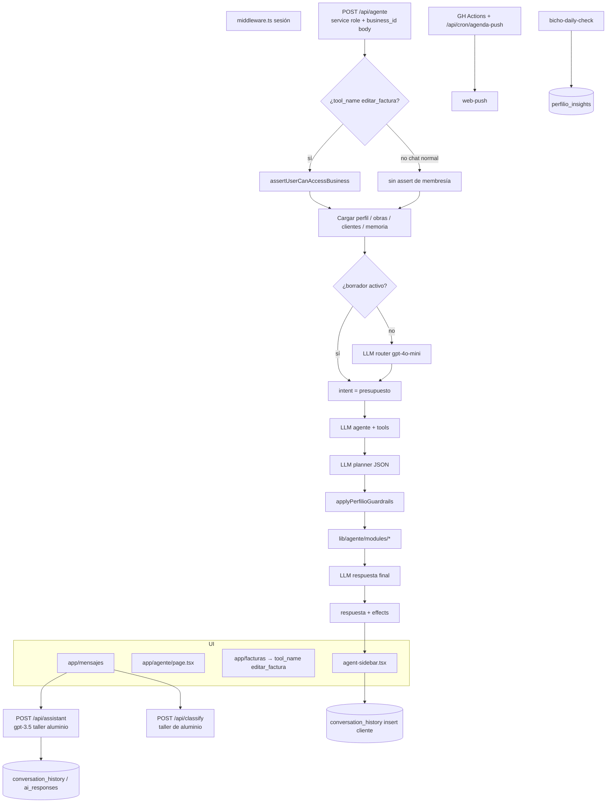
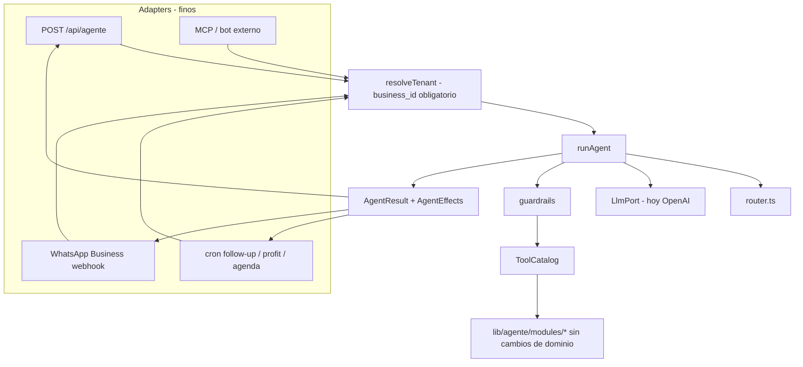

# Guía de mejoras y Agent Runtime — Perfilio

Documento de trabajo **solo-docs** para Ander (adopico83).  
Análisis del código **real** del repo (rama `main` en el momento de la revisión: commit `5545864` — *refactor: extrae router a lib/agente/router.ts — God File 1199L*).  
No implementa el Agent Runtime. El anexo final es un **spike de interfaces** (contrato propuesto), no código de producción.

**Producto:** agente de operaciones IA para gremios (Euskadi). SaaS + TFG DAW.  
**Stack real:** Next.js 16.1.6, React 19, TypeScript 5, Tailwind 4, Supabase, OpenAI `gpt-4o-mini` (cerebro Bicho) + `gpt-3.5-turbo` (legado), Resend, Vercel. PWA con push.

**Regla de oro del repo (sigue vigente):** lógica de dominio en `lib/agente/modules/*`. El orquestador no se hincha. Tenancy por `business_id`.

**Cursor no es el runtime del producto.** Cursor es solo para desarrollo. El agente del SaaS es Bicho (`/api/agente`).

---

## 0. Correcciones al contexto previo

Lo que se daba por conocido, contrastado con el código:

| Creencia | Realidad en el repo |
|----------|---------------------|
| God File `app/api/agente/route.ts` ~4.800 líneas | **1.199 líneas**. Los módulos ya están extraídos. El README sigue diciendo «~4.800». |
| `src/types/database.ts` «casi vacío» | No está vacío: tipa **solo** `bicho_notifications`. El resto del esquema **no existe** en types. |
| CI inexistente | Hay **un** workflow: `.github/workflows/agenda-push.yml` (cron cada 10 min). **No** hay lint+test+build. |
| Sin PWA (`docs/ESTADO-PROYECTO.md`) | **Sí hay PWA**: `public/manifest.json`, `public/sw.js`, push en `app/api/push/*`. El SW **no** cachea navegación (no hay modo casco offline). |
| Weather = Open-Meteo (`ESTADO-PROYECTO.md`) | `lib/weather.ts` es **OpenWeather** (`OPENWEATHER_API_KEY`). |
| `AUTH_SETUP.md`: «`/api/*` públicas» | Falso. `middleware.ts` exige sesión en `/api/*` salvo `/api/cron/*` y `/api/lista-espera-notificacion`. |
| TicketBAI «en roadmap» | Landing + FAQ lo venden; el PDF **hardcodea emisor Pino**. No hay integración TBAI. |
| WhatsApp como canal del agente | Solo CTAs de landing a un número personal. **No hay bot.** |
| Profit Protector inexistente | Hay un **germen** en `supabase/functions/bicho-daily-check` (`margen_riesgo`, `HOURLY_COST = 32`, umbral 80 %). |

---

## 1. Estado actual del agente

### 1.1 Mapa de archivos (lo que existe hoy)

```
Orquestación
├── app/api/agente/route.ts              # Orquestador HTTP (1199 L). Prompt, router, plan, tools, respuesta.
├── app/api/agente/conversaciones/route.ts
├── lib/agente/router.ts                 # Clasificador de intención + subset de tools
├── lib/agente/guardrails.ts             # Dedup, orden, reglas presupuesto/factura
└── lib/agente/modules/
    ├── documentos.ts      1632 L   facturas, albaranes, extras, dictado, tarifas
    ├── presupuestos.ts    1408 L   listados, estados, borrador conversacional
    ├── agenda.ts          1417 L   CRUD agenda + resolución cliente/obra
    ├── obras-clientes.ts  1105 L   obras, clientes, ficha, asociación docs
    ├── gastos.ts           916 L   ticket, vincular, editar, borrar
    ├── operarios.ts        784 L   jornada, horas obra/operario
    ├── diario.ts           563 L   entrada + PDF
    ├── canvas.ts           268 L   vista visual
    ├── calculo.ts          235 L   mediciones
    └── correo.ts           171 L   Gmail leer/borrador

Cerebro legado (paralelo, sin tools)
├── app/api/assistant/route.ts           # gpt-3.5-turbo, prompt «taller aluminio/PVC»
├── app/api/classify/route.ts            # urgencia, prompt «taller de aluminio»
├── app/mensajes/page.tsx                # cola conversations + ai_responses
├── app/agente/page.tsx                  # chat /api/agente + cola pendiente del legado
└── app/test-assistant/page.tsx
    app/test-classify/page.tsx

UI God
├── components/dashboard/agent-sidebar.tsx   2249 L
├── app/dashboard/page.tsx                   2166 L
├── components/dashboard/obra-modal.tsx       848 L
└── app/page.tsx (landing)                   1520 L + app/page.tsx.tmp (basura)

Tenancy / auth
├── middleware.ts
├── lib/supabase/server.ts          createClient + createServiceClient (service role)
├── lib/supabase/get-business-id.ts # business_profiles.user_id (1:1, timeout 5s)
└── assertUserCanAccessBusiness     # SOLO en el atajo editar_factura, no en el chat

Cerebro batch (tercer hilo)
├── supabase/functions/bicho-daily-check/index.ts
│     insights, margen_riesgo, hardcoded Pino, DEFAULT_BUSINESS_ID = 'pino'
├── app/api/cron/agenda-push/route.ts
└── .github/workflows/agenda-push.yml

Docs desalineadas
├── DATABASE.md                 esquema de 4 tablas, irreal
├── types/index.ts              copia de ese esquema
├── src/types/database.ts       solo bicho_notifications
├── AUTH_SETUP.md               APIs «públicas» (obsoleto)
├── README.md                   God File 4800 L (obsoleto)
├── docs/ESTADO-PROYECTO.md     abril 2026; PWA/CI/meteo desfasados
└── docs/chuleta-agente.md      catálogo de tools incompleto vs módulos
```

### 1.2 Cómo corre Bicho hoy (chat del dashboard)

1. **UI** (`agent-sidebar.tsx` o `app/agente/page.tsx`) hace `POST /api/agente` con `{ mensaje, business_id, historial, imagenesUrls? }`.
2. **Middleware** exige sesión. El `business_id` **lo manda el cliente**.
3. El route abre **service role** (`createServiceClient`) y carga `business_profiles` por id. Si el perfil existe, sigue. **No comprueba** que el usuario pertenezca a ese negocio (salvo el atajo `tool_name: 'editar_factura'`).
4. **Router** (`lib/agente/router.ts`): si hay `presupuesto_borrador` en `en_construccion` **fuerza** categoría `presupuesto` y **salta** el clasificador LLM. Si no, una llamada `gpt-4o-mini` (max 30 tokens) elige: `documentos | emails | agenda | gastos | diario | clientes | calculo | operarios | presupuesto | general`.
5. Se recorta el catálogo de tools (`toolsForAgentIntent`). `general` = todas.
6. Llamada principal `gpt-4o-mini` con tools. Si hay `tool_calls`:
   - **Segunda** llamada LLM («planificador») que reescribe el plan en JSON.
   - `applyPerfilioGuardrails` (dedup, bloqueo borrar presupuesto aceptado/facturado, orden destructivo→write→comunicación→read).
   - `runTool` despacha a módulos (o al `switch` residual del route: mensajes pendientes, maps, meteo, memoria, operarios).
   - **Tercera** llamada LLM para redactar la respuesta final.
7. Respuesta JSON: `{ respuesta, email_pendiente, canvas, obra_modal }`.
8. **La persistencia del chat la hace el cliente** (`conversation_history` insert desde el sidebar). El orquestador **no** guarda el turno.

Coste típico por mensaje con tools: **3 llamadas OpenAI** (router + agente + planner) + 1 de redacción. Con borrador activo: 2–3 (sin router).

### 1.3 Catálogo real de tools (nombres)

Inventario por módulo / route. Este es el catálogo que un Runtime debería reutilizar **sin copiar**.

| Origen | Tools |
|--------|--------|
| `documentos.ts` | `obtener_facturas_pendientes`, `obtener_albaranes_pendientes`, `listar_facturas`, `listar_albaranes`, `albaranes_sin_facturar`, `cambiar_estado_factura`, `cambiar_estado_albaran`, `editar_factura`, `editar_albaran`, `generar_presupuesto_por_dictado`, `gestionar_tarifas`, `crear_presupuesto`, `crear_factura`, `crear_albaran`, `registrar_extra`, `listar_extras`, `convertir_albaran_a_factura` |
| `presupuestos.ts` | `listar_presupuestos`, `obtener_presupuestos_pendientes`, `cambiar_estado_presupuesto`, `editar_presupuesto`, `vincular_presupuesto_cliente`, `convertir_presupuesto_a_albaran`, `convertir_presupuesto_a_factura`, `iniciar_borrador_presupuesto`, `agregar_partida_borrador`, `modificar_partida_borrador`, `listar_partidas_borrador`, `eliminar_partida_borrador`, `confirmar_borrador`, `cancelar_borrador`, `obtener_borrador_activo` |
| `obras-clientes.ts` | `crear_obra`, `actualizar_obra`, `buscar_obra`, `ver_ficha_obra`, `asociar_documentos_a_obra`, `crear_cliente`, `buscar_cliente`, `ver_cliente` |
| `agenda.ts` | `obtener_agenda`, `crear_recordatorio`, `editar_recordatorio`, `eliminar_recordatorio`, `eliminar_evento_agenda`, `modificar_evento_agenda` |
| `gastos.ts` | `registrar_gasto_ticket`, `vincular_gasto`, `eliminar_gasto`, `modificar_gasto` |
| `diario.ts` | `crear_entrada_diario`, `generar_pdf_diario`, `eliminar_entrada_diario` |
| `operarios.ts` | `registrar_jornada`, `listar_operarios`, `consultar_horas_obra`, `consultar_horas_operario`, `eliminar_registro_jornada` |
| `correo.ts` | `leer_emails_recientes`, `enviar_email` |
| `calculo.ts` | `calcular_medicion` |
| `canvas.ts` | `mostrar_vista_visual` |
| **Aún en el route** | `obtener_mensajes_pendientes`, `get_directions`, `consultar_tiempo`, `guardar_memoria`, `eliminar_memoria` + dispatch de operarios (las defs están en el módulo, el `switch` sigue en el route) |

`chuleta-agente.md` **no** lista operarios, borrador de presupuesto, extras, memoria, maps, meteo, ni varias tools de agenda/gastos. No usarla como inventario.

### 1.4 Auth y tenancy (el hueco real)

Hay **dos** resolutores de negocio, y no coinciden.

| Pieza | Qué hace | Hueco |
|-------|----------|--------|
| `getBusinessIdClient` / `getBusinessIdServer` | `business_profiles.user_id = auth.uid()`, `limit(1)` | Ignora `business_users`. Un usuario invitado a un negocio ajeno **no** resuelve el `business_id` correcto. |
| `assertUserCanAccessBusiness` | `business_users` **o** fallback `business_profiles.user_id` | Bien diseñado, pero **solo** se llama en el atajo `tool_name === 'editar_factura'`. |
| Chat `POST /api/agente` | Service role + `business_id` del body | Cualquier sesión autenticada que conozca un UUID de otro negocio **opera con service role** sobre ese tenant. |
| `GET /api/agente/conversaciones` | Service role + `business_id` query | Igual: lista historial de **cualquier** negocio si pasas el id. |
| APIs REST (`/api/obras`, clientes, diario, PDF…) | Suelen comprobar `business_users` **o** owner | Más saneadas que el chat. |
| `/api/assistant` | Service role, `business_id` opcional del body, **sin** assert de membresía | Segundo agujero, además de prompt legado. |
| Cron `/api/cron/*` | Exento de sesión; usa `CRON_SECRET` | Correcto como canal de sistema. |

El service role es necesario (el agente escribe en muchas tablas). El fallo no es usarlo: es **no atar** `auth.uid()` ↔ `business_id` **antes** de despachar tools.

### 1.5 Doble (en realidad triple) cerebro

```
A) Bicho SaaS          POST /api/agente          gpt-4o-mini + tools
B) Asistente legado    POST /api/assistant       gpt-3.5, «taller aluminio», sin tools
                       POST /api/classify        gpt-3.5, «taller de aluminio»
                       tablas conversations + ai_responses (aprobar/rechazar)
C) Bicho batch         supabase/functions/bicho-daily-check
                       gpt-4o-mini, prompt «asistente de Pino», insights
```

`app/mensajes` vive en B. `app/agente` mezcla A (chat) y B (modal de pendientes). El sidebar del dashboard es A. El daily-check es C y **no** pasa por las tools de A.

Unificar A y C es el argumento fuerte del Runtime. B es candidato a **deprecar**, no a extraer.

### 1.6 UI: dónde está el God

| Archivo | Líneas | Rol |
|---------|--------|-----|
| `components/dashboard/agent-sidebar.tsx` | 2249 | Chat, voz, adjuntos, historial, saludo diario, canvas, email pendiente, persistencia |
| `app/dashboard/page.tsx` | 2166 | Contadores, agenda CRUD, Gmail, widgets, `perfilio:refresh` |
| `app/page.tsx` | 1520 | Landing (y existe `app/page.tsx.tmp` de 41 KB) |
| `components/dashboard/obra-modal.tsx` | 848 | Ficha obra |
| `app/agente/page.tsx` | 570 | Chat alternativo + cola legado |

El shell (`dashboard-shell.tsx`, 30 L) está limpio. El peso está en sidebar + dashboard page.

### 1.7 Tablas que el código usa de verdad

`DATABASE.md` documenta `materiales`, `clientes`, `presupuestos`, `facturas` con columnas que **no** coinciden. El código toca, como mínimo:

`business_profiles`, `business_users`, `obras`, `clientes`, `presupuestos` (`presupuesto_generado`, `importe_total`, `obra_id`, `es_extra`, `parent_id`, `mensaje_cliente`…), `albaranes`, `facturas` (`numero_factura`, `lineas`, `base_imponible`…), `gastos`, `gastos_documentos`, `diario_obra`, `tarifas`, `agenda`, `operarios`, `registros_jornada`, `presupuesto_borrador`, `presupuesto_borrador_items`, `memoria_negocio`, `conversation_history`, `conversations`, `ai_responses`, `gmail_tokens`, `push_subscriptions`, `bicho_notifications`, `perfilio_insights`.

No hay tabla `materiales` usada en runtime. `types/index.ts` describe el esquema muerto.

---

## 2. Comparativa HOY vs Agent Runtime propuesto

### 2.1 Qué es (y qué no es) el Runtime

**Sí:** un orquestador extraído y **invocable** desde dashboard, crons, un bot WhatsApp Business (aparte), y más adelante MCP. Mismas tools, mismo `business_id`, mismos guardrails, LLM pluggable.

**No:** sustituir Bicho por Cursor. No un agente «de Cursor» en producción. No un orquestador de 3.000 líneas con SQL dentro.

### 2.2 Responsabilidades

| Responsabilidad | HOY | Runtime propuesto |
|-----------------|-----|-------------------|
| Entrada HTTP / cron / bot | Cada ruta implementa su bucle | **Adapters** finos que construyen `AgentRequest` y llaman `runAgent()` |
| Auth + tenancy | Parcial, inconsistente | **Un** `resolveTenant(actor) → { userId, businessId }` obligatorio antes de tools |
| Catálogo de tools | Arrays sueltos por módulo + leftovers en el route | `ToolCatalog` (nombre → schema + handler). Los módulos **siguen** siendo los handlers |
| Router de intención | `lib/agente/router.ts` (bien extraído) | Se queda. El Runtime lo llama; no se reescribe |
| Guardrails | `lib/agente/guardrails.ts` (bien extraído) | Se queda. Se aplica a **todo** canal, no solo al chat |
| LLM | `new OpenAI()` + `'gpt-4o-mini'` incrustado en el route | `LlmPort` (hoy OpenAI; mañana otro modelo sin tocar tools) |
| Prompt de sistema | Construido en el route (perfil, obras, clientes, memoria, agenda) | `buildSystemPrompt(ctx)` extraído; el route no lo arma |
| Efectos UI | `email_pendiente`, `canvas`, `obra_modal` acoplados al JSON del route | `AgentEffects` tipados; el adapter HTTP los mapea. Un cron los ignora o los traduce a push |
| Persistencia de chat | Cliente (sidebar) | Decisión explícita: o el Runtime persiste, o el adapter. Hoy está en el sitio peor (el browser) |
| Canal legado assistant/classify | Paralelo, otro prompt | Fuera del Runtime. Deprecar o reescribir como tool `clasificar_urgencia` + plantilla por `business_profiles.sector` |

### 2.3 Acoplamientos que el Runtime debe romper

1. **`business_id` del body sin assert** — el adapter HTTP debe resolver tenant, no fiarse del cliente.
2. **`runTool` switch en el route** — memoria, maps, meteo, mensajes pendientes y operarios aún viven ahí.
3. **Planner LLM extra** — hoy hay una pasada que reescribe `tool_calls` a JSON. Es latencia y un sitio más donde el plan puede divergir. El Runtime puede ejecutar los `tool_calls` nativos + guardrails, y dejar el planner como opt-in.
4. **Prompt «Pino» / «taller de aluminio»** — tres sitios distintos. El Runtime usa **solo** `business_profiles` + `memoria_negocio`.
5. **Crons que no ven tools** — `agenda-push` y `bicho-daily-check` duplican criterios (horas, margen, agenda) en vez de llamar `consultar_horas_obra` / `listar_presupuestos` / `obtener_agenda`.
6. **Efectos de UI en el dominio** — `mostrar_vista_visual` y `enviar_email` (borrador) son tools válidas; abrir el modal es cosa del adapter dashboard.

### 2.4 Esfuerzo realista del Runtime

No es un rewrite. El 70 % del dominio **ya está** en módulos. Falta:

- Contrato único (`AgentRequest` / `AgentResult` / `ToolHandler`).
- `resolveTenant` obligatorio.
- Mover leftovers del route a módulos (`memoria`, `maps`, `meteo`, `mensajes-pendientes`).
- Un `runAgent(req)` que hoy solo llama el route HTTP; mañana también un cron o un webhook de WhatsApp Business.

Eso es **M**, no L — **si** no se aprovecha para meter features nuevas dentro del orquestador.

---

## 3. Diagramas

### 3.1 Flujo HOY



### 3.2 Flujo con Agent Runtime



El dominio **no** se mueve al Runtime. El Runtime **llama** a los módulos.

---

## 4. Priorización

Escala: **S** &lt; medio día · **M** 1–3 días efectivos · **L** varias iteraciones / dependencia externa.  
No son calendarios: son tamaño técnico.

### 4.1 Quick-wins

| ID | Qué | Esfuerzo | Riesgo | Dependencias | Notas |
|----|-----|----------|--------|--------------|-------|
| Q1 | Borrar `app/page.tsx.tmp` | S | Nulo | Ninguna | 41 KB de basura. No referenciado. |
| Q2 | Emisor factura: quitar `EMPRESA_PINO_FALLBACK` / `PINO_EMISOR` | S–M | Medio (PDFs en producción de Pino) | Columnas fiscales en `business_profiles` (nif, teléfono, email) | **Issuer**, no el cliente del dashboard. Tres sitios: `app/api/pdf/factura/[id]/route.tsx`, `lib/pdf/factura.tsx`, `components/facturas/invoice-editor.tsx`. Fallback = perfil incompleto, no Pino. |
| Q3 | Resend: `RESEND_FROM` en todos los envíos | S | Bajo (dominio no verificado = bounce) | Dominio verificado en Resend | `lib/email.ts` está **hardcodeado** a `onboarding@resend.dev`. Lista de espera ya admite env. |
| Q4 | Classify + assistant: quitar «taller de aluminio» | S | Bajo | Decidir si B se depreca | Mientras existan, el prompt debe salir de `business_profiles.sector` o un texto genérico de gremio. |
| Q5 | CI: lint + test + build en PR | S | Bajo (flakes) | Secrets no necesarios si tests están mocked | Hoy solo `agenda-push.yml`. Jest: ~88 tests / 24 suites. |
| Q6 | Alinear `DATABASE.md` + types | M | Bajo (doc) / medio si se genera `database.ts` a ciegas | Dump real de Supabase | `src/types/database.ts` no puede seguir con una sola tabla. `types/index.ts` está muerto. |

### 4.2 Deuda

| ID | Qué | Esfuerzo | Riesgo | Dependencias |
|----|-----|----------|--------|--------------|
| D1 | **Tenancy en `/api/agente` (chat + conversaciones)** | S–M | Alto si se ignora (fuga cross-tenant) | Extraer `assertUserCanAccessBusiness` a `lib/supabase/` y usarlo **siempre** |
| D2 | `getBusinessId*` debe respetar `business_users` | S | Medio (cambia qué negocio ve un invitado) | Misma helper que D1 |
| D3 | God UI sidebar + dashboard | L | Alto (regresión UX) | Tests de humo; no mezclar con Runtime |
| D4 | Módulos gordos (`documentos` 1632, `agenda` 1417, `presupuestos` 1408) | M–L | Medio | Partir por subdominio **dentro** de `modules/`, no devolver lógica al route |
| D5 | Leftovers del route → módulos | S–M | Bajo | `memoria`, `maps`, `meteo`, `mensajes-pendientes` |
| D6 | Deprecar cerebro B (`assistant` + `classify` + `/mensajes`) o absorberlo | M | Medio (si algún beta usa la cola) | Confirmar uso real |
| D7 | Service role: documentar y acotar (nunca en cliente) | S | — | Ya no está en el browser; el riesgo es el hueco D1 |
| D8 | Docs internas (`README`, `AUTH_SETUP`, `ESTADO-PROYECTO`, chuleta) | S–M | Nulo | Tras Q6 |

### 4.3 Features deseadas (estado real)

| Feature | Estado en código | Esfuerzo residual | Encaja en Runtime | Dependencias |
|---------|------------------|-------------------|-------------------|--------------|
| **Profit Protector** | Germen en `bicho-daily-check`: `margen_riesgo` = horas × 32 € &gt; 80 % del presupuesto. Prompt y `DEFAULT_BUSINESS_ID` = Pino. | M para generalizar (coste/h y umbral por negocio, push, tool `alertar_margen_obra`) | Sí: cron adapter + tool | D1, tarifas/coste en perfil o `memoria_negocio` |
| **Follow-up presupuestos** | El daily-check menciona «presupuesto sin firmar» en agenda. No hay cron de recordatorio al cliente ni tool dedicada. | M | Sí: cron que llama tools de listado + `enviar_email` (borrador o plantilla) | Política de «cuántos días», D1, Resend/Gmail |
| **TicketBAI** | Marketing + emisor Pino hardcodeado. Cero API. | L | No al inicio. Es emisión fiscal, no chat. | Q2 (datos fiscales reales), proveedor [ticketbaiws.eus](https://ticketbaiws.eus), certificados |
| **Parte de obra voz+foto** | Diario + Whisper en sidebar + visión. Falta flujo «parte» (cuadrilla, horas, materiales, firma). | M | Tools nuevas en `diario.ts` / `operarios.ts` | No bloquea Runtime |
| **Modo casco offline** | PWA sí; SW **no** sirve app routes desde caché (`fetch` de navegación = red). Sin cola offline. | L | No. Es cliente/SW. | D3 (sidebar), diseño de sync |
| **Cuadrante cuadrilla** | Hay `operarios` + `registros_jornada`. No hay vista semanal ni asignación. | M | Tools de lectura ya existen; falta UI | No bloquea Runtime |
| **Albarán desde foto** | Visión genérica en el chat; `crear_albaran` es texto. No hay OCR→albarán. | M | Tool nueva en `documentos.ts` | SDD (confirmación) |
| **Extras con OK cliente** | `registrar_extra` crea presupuesto hijo + **borrador** de email. No hay token/enlace de aceptación ni estado `ok_cliente`. | M | Tool `confirmar_extra_cliente` + ruta pública firmada | No mezclar con WhatsApp personal |

### 4.4 Runtime

| ID | Qué | Esfuerzo | Riesgo | Dependencias |
|----|-----|----------|--------|--------------|
| R0 | Contrato + `runAgent` + `resolveTenant` (el route HTTP solo adapta) | M | Medio (romper tests de `/api/agente`) | D1, D5 |
| R1 | `LlmPort` (envolver OpenAI, no abstraer de más) | S | Bajo | R0 |
| R2 | Cron adapter: daily-check y follow-up llaman tools | M | Medio | R0, Profit/Follow-up |
| R3 | WhatsApp **Business** adapter | L | Alto (Meta, plantillas, RGPD) | R0, D1, **no** número personal |
| R4 | MCP / bots externos | L | Alto (superficie de auth) | R0, tokens por `business_id` |

---

## 5. Orden de ataque recomendado

### Fase 0 — Higiene (antes de cualquier Runtime)

Q1 (borrar tmp) → Q3 (Resend from) → Q4 (prompts legado) → Q5 (CI lint+test+build).  
Q2 (emisor PDF) en cuanto haya nif/tel/email en `business_profiles` para **todos** los tenants; hasta entonces, fallback al **perfil**, no a Pino.

Esto limpia basura, deja de mentir en emails/clasificación y pone red de seguridad.

### Fase 1 — Tenancy (no negociable si hay más de un negocio)

D1 + D2. Extraer `assertUserCanAccessBusiness` / `resolveTenant`. El chat y `conversaciones` **rechazan** `business_id` ajeno. `getBusinessId*` consulta `business_users` primero.

Sin esto, un Runtime con MCP o WhatsApp **amplía** el agujero.

### Fase 2 — Cerrar el orquestador (preparar Runtime sin venderlo)

D5: leftovers a módulos.  
Q6 + D8: `DATABASE.md` y types al esquema real (generar `database.ts` desde Supabase, no a mano).  
D6: decisión go/no-go de `/mensajes` + `/api/assistant`. Si nadie lo usa en beta → deprecar rutas y tablas en un PR aparte.

**No** partir aún el God UI (D3) ni los módulos de 1.400 L (D4), salvo que un bug lo exija.

### Fase 3 — Runtime mínimo (R0 + R1)

Mover el bucle del route a `lib/agente/runtime.ts` (nombre orientativo). El route queda:

```ts
const tenant = await resolveTenant(req);
return json(await runAgent({ tenant, mensaje, historial, imagenes }));
```

Misma respuesta JSON para no romper el sidebar. Tests de `__tests__/api.agente*.test.ts` siguen en verde.

**Criterio de éxito:** el dashboard no cambia; el código del bucle se puede importar desde un cron.

### Fase 4 — Features que el Runtime multiplica

Orden de negocio sugerido (Euskadi, beta Pino primero):

1. **Profit Protector** generalizado (el daily-check ya calcula; falta multi-tenant + push + tool).
2. **Follow-up presupuestos** (cron + plantilla; humano en el loop si el envío es Gmail).
3. **Extras con OK cliente** (estado + enlace firmado; el extra **ya** se registra).
4. Parte de obra voz+foto (extiende diario/operarios).
5. Albarán desde foto (visión + SDD).

TicketBAI, cuadrante y modo casco **después**. No piden Runtime; piden datos fiscales, UI y SW.

### Fase 5 — Canales extra (solo con Runtime ya usado por un cron)

WhatsApp Business (número de empresa, plantillas, opt-in). MCP si un integrador lo pide.  
Si Fase 3 no se ha usado ni en un cron, **no** abrir Fase 5.

---

## 6. Qué NO hacer

1. **No sustituir Bicho por Cursor.** Cursor no corre en Vercel con el `business_id` del cliente. No es el orquestador.
2. **No conectar WhatsApp personal** (el 697 de la landing es captación, no canal de producto). Un bot va por WhatsApp Business Cloud API, tenant a tenant.
3. **No hinchar `app/api/agente/route.ts`.** Feature nueva = módulo o tool en `lib/agente/modules`. El Runtime, si se hace, **saca** el bucle; no mete SQL.
4. **No saltarse tenancy** «porque el middleware ya pide login». Login ≠ membresía. Service role + UUID adivinado/leaked = lectura/escritura cruzada.
5. **No copiar tools** a un servidor MCP o a un bot. Se **importan**. Duplicar `registrar_gasto_ticket` es el fallo que el Runtime evita.
6. **No meter TicketBAI en el orquestador.** Es un puerto de facturación (`emitirFacturaTBAI`), llamado desde `crear_factura` / PDF, no un tool de chat.
7. **No borrar el cliente del dashboard** al quitar `EMPRESA_PINO_FALLBACK`. El fallback es el **emisor**. Los clientes de `clientes` no se tocan.
8. **No forzar Runtime para desbloquear Profit Protector / follow-up.** Se pueden hacer como cron + service role **con** `resolveTenant` de sistema. El Runtime solo evita que el cron reimplemente las queries.
9. **No reescribir el God UI** en el mismo PR que el Runtime. Dos regresiones a la vez.
10. **No usar el planner LLM como capa de seguridad.** Los guardrails son código (`guardrails.ts`). El planner es heurística y latencia.
11. **No hardcodear Pino** en prompts de producción (`bicho-daily-check`, PDF, classify). Beta ≠ producto.
12. **No force-push ni mergear este PR en `main` desde el agente.** Solo-docs, revisión de Ander.

---

## 7. Checklist de decisión (Ander)

Marca en frío. Si un bloque queda en «no sé», la respuesta por defecto es **no-go** de esa pieza.

### Runtime

- [ ] ¿Voy a tener **más de un canal** en 2–3 iteraciones (cron de verdad + dashboard, o WhatsApp Business)?  
      **Sí → go Runtime (Fase 3) después de Fase 1.**  
      **No → no extraer Runtime; sí extraer leftovers (D5) y cerrar tenancy (D1).**
- [ ] ¿El daily-check y el chat deben compartir **las mismas** reglas de margen / pendientes?  
      **Sí → go Runtime o, como mínimo, que el cron importe handlers de módulos.**
- [ ] ¿Hay (o habrá) un integrador externo / MCP?  
      **Sí → Runtime + tokens por `business_id`. No → aparcar R4.**

### Orden vs features

- [ ] ¿Pino (u otro beta) se queja **esta semana** de margen u obras paradas?  
      **Sí → Profit Protector (generalizar daily-check) **antes** de un Runtime perfecto.**
- [ ] ¿Hay presupuestos enviados que se pudren?  
      **Sí → follow-up. No requiere Runtime.**
- [ ] ¿TicketBAI es bloqueante legal para emitir?  
      **Sí → Q2 + proyecto TBAI aparte. No mezclar con el agente.**
- [ ] ¿Alguien usa `/mensajes` o `/api/assistant` en serio?  
      **No → deprecar (D6). Sí → reescribir prompt; no invertir en features nuevas ahí.**

### Riesgo

- [ ] ¿Hay más de un `business_profiles` real en prod?  
      **Sí → D1 es P0, por encima de features.**
- [ ] ¿El PDF de factura de Pino puede cambiar de NIF/dirección esta semana?  
      **No tocar Q2 sin columnas de perfil rellenas y una factura de prueba.**

### Go / no-go resumido

| Decisión | Go si… | No-go si… |
|----------|--------|-----------|
| Agent Runtime | Fase 1 hecha + al menos un segundo caller (cron) | Solo dashboard, y el route de 1199 L no duele |
| Deprecar assistant/classify | Cero uso en beta | Hay cola real de clientes externos |
| WhatsApp | Runtime + Business API + opt-in | Tentación de usar el móvil personal |
| TicketBAI | Datos fiscales por tenant + proveedor | Seguir hardcodeando Pino «porque es el único cliente» |
| Modo casco | Parte de obra ya útil online | Empezar por SW sin modelo de sync |

---

## 8. Referencias rápidas (paths)

| Tema | Path |
|------|------|
| Orquestador | `app/api/agente/route.ts` |
| Conversaciones | `app/api/agente/conversaciones/route.ts` |
| Router | `lib/agente/router.ts` |
| Guardrails | `lib/agente/guardrails.ts` |
| Módulos | `lib/agente/modules/*.ts` |
| Service role | `lib/supabase/server.ts` → `createServiceClient` |
| Resolve negocio 1:1 | `lib/supabase/get-business-id.ts` |
| Middleware | `middleware.ts` |
| Sidebar | `components/dashboard/agent-sidebar.tsx` |
| Dashboard | `app/dashboard/page.tsx` |
| Cerebro legado | `app/api/assistant/route.ts`, `app/api/classify/route.ts`, `app/mensajes/page.tsx` |
| PDF emisor Pino | `app/api/pdf/factura/[id]/route.tsx`, `lib/pdf/factura.tsx`, `components/facturas/invoice-editor.tsx` |
| Resend | `lib/email.ts`, `app/api/lista-espera-notificacion/route.ts` |
| Daily-check / margen | `supabase/functions/bicho-daily-check/index.ts` |
| Cron push | `app/api/cron/agenda-push/route.ts`, `.github/workflows/agenda-push.yml` |
| PWA | `public/sw.js`, `public/manifest.json`, `app/api/push/*` |
| Types muertos / incompletos | `DATABASE.md`, `types/index.ts`, `src/types/database.ts` |
| Basura | `app/page.tsx.tmp` |
| Tests agente | `__tests__/api.agente*.test.ts`, `__tests__/operarios-agente-tools.test.ts` |

---

## Anexo A — Spike de interfaces (no implementar aún)

Contrato propuesto para Fase 3. Cabe en `lib/agente/runtime.ts` **cuando** Ander marque go. Hoy es solo especificación.

```ts
// SPIKE — no está en el repo. No copiar a producción sin Fase 1 (tenancy).

export type AgentChannel = 'dashboard' | 'cron' | 'whatsapp_business' | 'mcp';

export type TenantContext = {
  userId: string | null;       // null en cron de sistema
  businessId: string;          // SIEMPRE resuelto en servidor, nunca del body a ciegas
  channel: AgentChannel;
};

export type AgentRequest = {
  tenant: TenantContext;
  mensaje: string;
  historial?: { role: 'user' | 'assistant'; content: string }[];
  imagenesUrls?: string[];
  /** Atajo tipado (hoy: editar_factura desde el editor). */
  directTool?: { name: string; args: Record<string, unknown> };
};

export type AgentEffects = {
  emailPendiente?: { para: string; asunto: string; cuerpo: string };
  canvas?: { tipo: string; titulo: string; datos: unknown[] };
  obraModal?: { obra_id: string; obra_nombre: string };
};

export type AgentResult = {
  respuesta: string;
  effects: AgentEffects;
};

export type ToolHandler = (
  args: Record<string, unknown>,
  ctx: TenantContext,
  extras: { mensajeTrim: string; supabase: unknown; openai?: unknown }
) => Promise<unknown>;

export type LlmPort = {
  complete(opts: {
    messages: unknown[];
    tools?: unknown[];
    maxTokens?: number;
    temperature?: number;
  }): Promise<unknown>;
};

export function resolveTenant(/* req + auth */): Promise<TenantContext>;
export function runAgent(req: AgentRequest): Promise<AgentResult>;
```

Reglas del spike:

- `businessId` **no** entra crudo del body: `resolveTenant` lo valida (`business_users` o owner).
- Los handlers actuales (`handlePresupuestos`, `handleDiario`, …) se adaptan a `ToolHandler` **sin** mover SQL.
- Un cron construye `AgentRequest` con `channel: 'cron'` y `userId: null`, pero `businessId` de la fila que itera.
- WhatsApp Business, si llega, es otro adapter. El número personal de la landing **no** es un adapter.

---

## Anexo B — Hallazgos que el README / ESTADO mienten

Útil para no planificar sobre docs viejas:

- God File **1199 L**, no 4800. Extracción de módulos **ya hecha** (commits `4d9831e`…`5545864`).
- Tests: README dice 88/24; `ESTADO-PROYECTO.md` dice 77/20. Contaje actual de `it(`/`test(` en `__tests__`: ~88 en 24 ficheros.
- PWA existe; modo offline de obra **no**.
- Lista de espera **ya** está excluida del middleware (el ESTADO la daba por rota).
- `AUTH_SETUP.md` § «APIs públicas» está mal: mentir ahí es riesgo de seguridad en onboarding.

---

*Guía generada a partir del código de `https://github.com/adopico83/perfilio`. Siguiente paso: Ander marca el checklist §7; el primer PR de código debería ser Fase 0+1, no el Runtime completo.*
